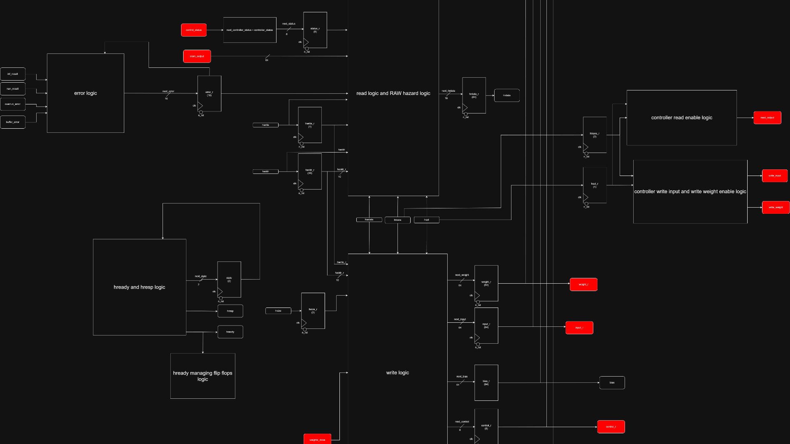
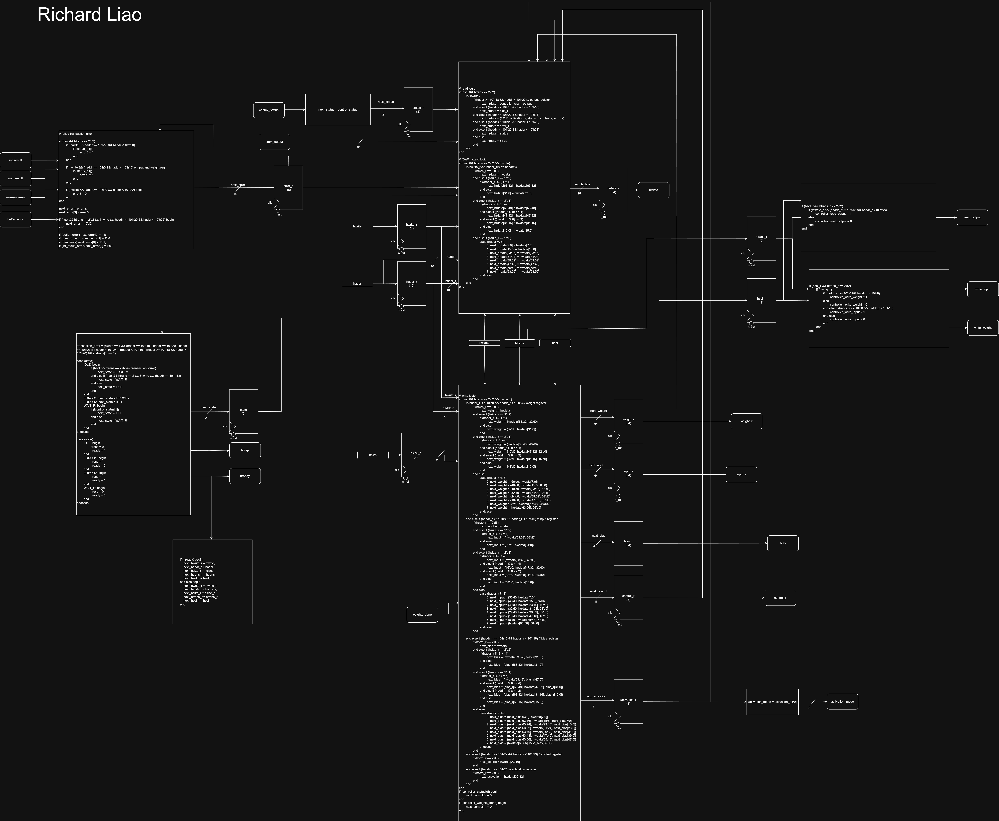

# AHB-Lite Systolic Array Co-Processor

**March 2026 - May 2026**

This repository showcases my RTL implementation of the **AHB-Lite subordinate interface** for a System-on-Chip (SoC) peripheral module featuring an 8x8 weight-stationary systolic array co-processor. Developed as part of an academic Cooperative Design Lab, this module provides hardware acceleration for fully-connected neural network inference (general-purpose matrix multiplication). My primary role was architecting the bus interface and memory-mapped control logic to ensure high-performance execution under strict latency constraints.

## 🚀 My Contributions (AHB Interface)

* **AHB-Lite Subordinate Interface**: Fully AMBA-compliant system bus interface implemented in SystemVerilog, supporting high-speed data transfers, burst modes, and seamless SoC integration.
* **Memory-Mapped Control Registers**: Custom architecture for control and status registers (CSRs) to configure and monitor the co-processor, featuring custom data forwarding logic to resolve Read-After-Write (RAW) bus hazards.
* **Robust FSM Control**: State machine logic to enforce strict AMBA compliance, dynamically managing `HREADY` transaction stalls and gracefully handling `HRESP` error responses.

## ⚙️ Overall System Capabilities

* **8x8 Weight-Stationary Systolic Array**: A high-throughput processing core designed for matrix multiplication operations, optimized for Fully Connected (MLP) neural network layers.
* **Custom Floating Point Arithmetic**: Operates on custom 8-bit minifloats (1 sign, 4 exponent, 3 mantissa) to optimize memory bandwidth, utilizing dedicated hardware for floating-point addition and multiplication.
* **Configurable Activation Functions**: Hardware support for multiple non-linear activation functions applied to network outputs, including ReLU, Leaky ReLU (α = 1/4), Binary, and Identity.
* **SRAM Data Buffering**: Integrates non-ideal SRAM models to handle high-capacity storage for input vectors, weights, and inference outputs.
* **Strict Latency Constraints**: Designed and verified to execute end-to-end inference within a strict 55-cycle maximum latency budget at a 100 MHz system clock.

## 📊 Architecture Diagrams

### Top-Level Architecture

### AHB-Lite Subordinate Interface

## 📁 Repository Structure

* **`/RTL/`**: Contains all the SystemVerilog source code for the co-processor.
  * `top_level.sv`: The top-level wrapper integrating the AHB interface, controller, and array.
  * `ahb.sv`: The AHB-Lite subordinate interface and memory-mapped register logic. *(My primary individual contribution)*
  * `ai_controller.sv`: State machine and control logic managing the inference execution.
  * `array.sv` & `array_cell.sv`: The 8x8 systolic processing element array.
  * `multiplier.sv`, `float_adder.sv`: Core arithmetic units used within the processing elements.
  * *Additional modules handling biases, activation functions, and control counters.*

## 🛠️ Technologies & Tools

* **Hardware Description Language**: SystemVerilog
* **Bus Protocol**: AMBA AHB-Lite
* **Verification**: SystemVerilog Testbenches
* **Architecture**: Weight-Stationary Systolic Array

## 👨‍💻 Project Scope & Integration

While the systolic array datapath and state controller were developed collaboratively within a 3-person team, **I was personally responsible for designing and implementing the entirety of the AHB-Lite subordinate interface (`ahb.sv`)**. This included architecting the memory-mapped control registers, creating custom data forwarding logic to resolve RAW bus hazards, and developing the FSM to enforce strict AMBA compliance.

I also played a key role in the overall integration of the AHB interface with the central state controller and the systolic processing array, which was achieved through rigorous co-simulation and validation to ensure all components functioned seamlessly together under the strict 55-cycle maximum latency constraint.

## 🔒 Confidentiality Notice

Please note that due to Non-Disclosure Agreements (NDAs), certain project assets—specifically the comprehensive SystemVerilog testbench suite and detailed simulation outputs/waveforms—have been excluded from this public repository.
